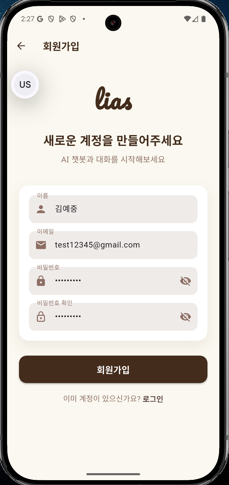
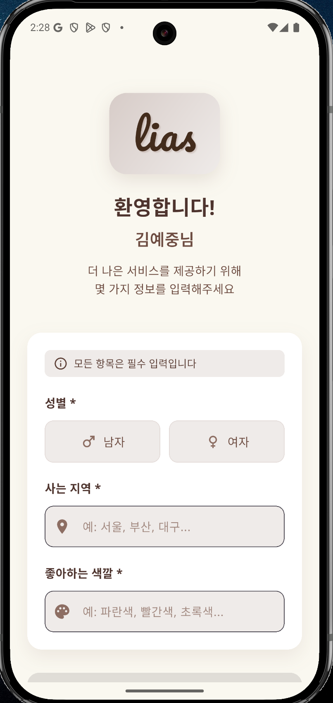
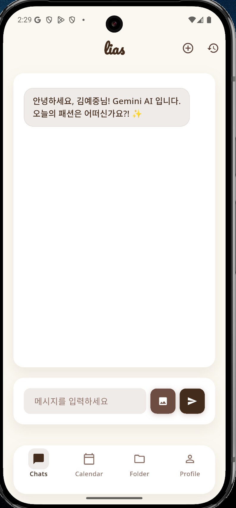
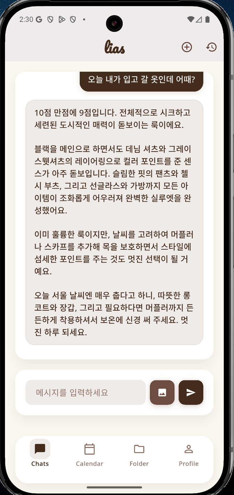
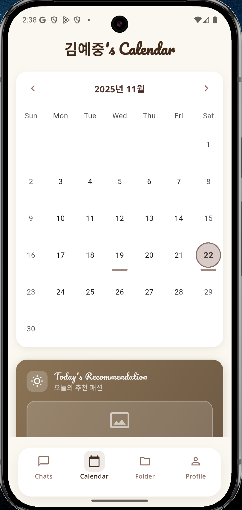
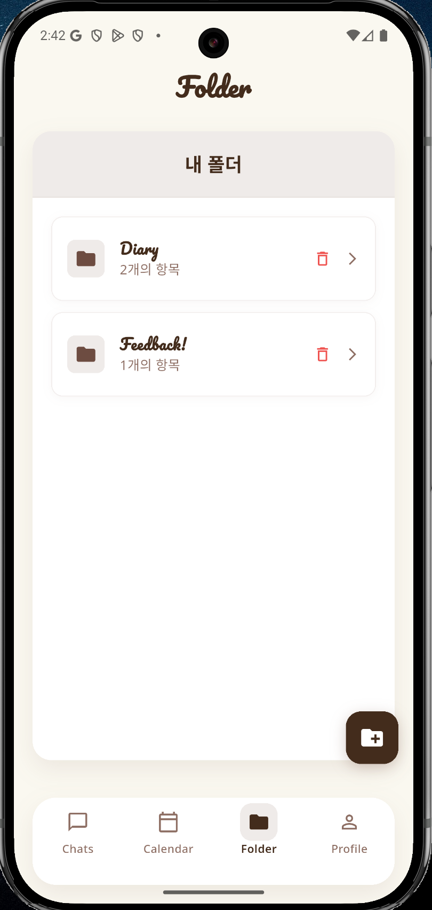
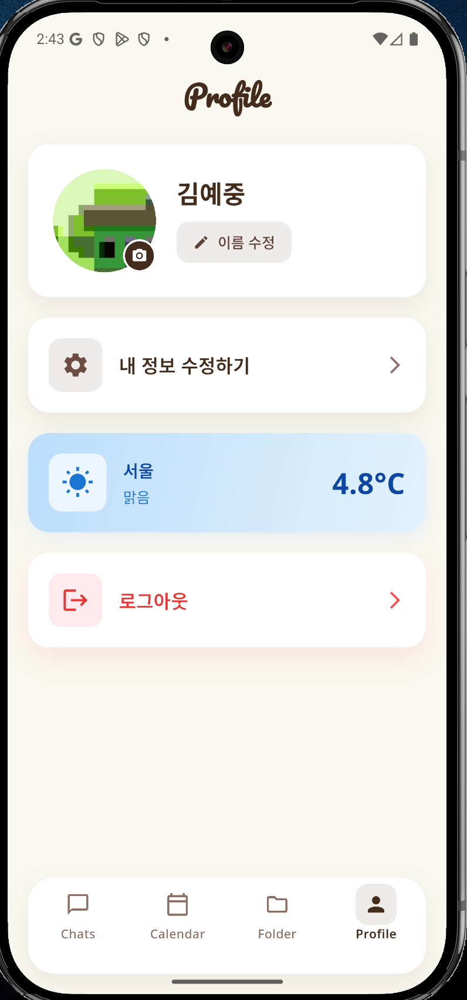
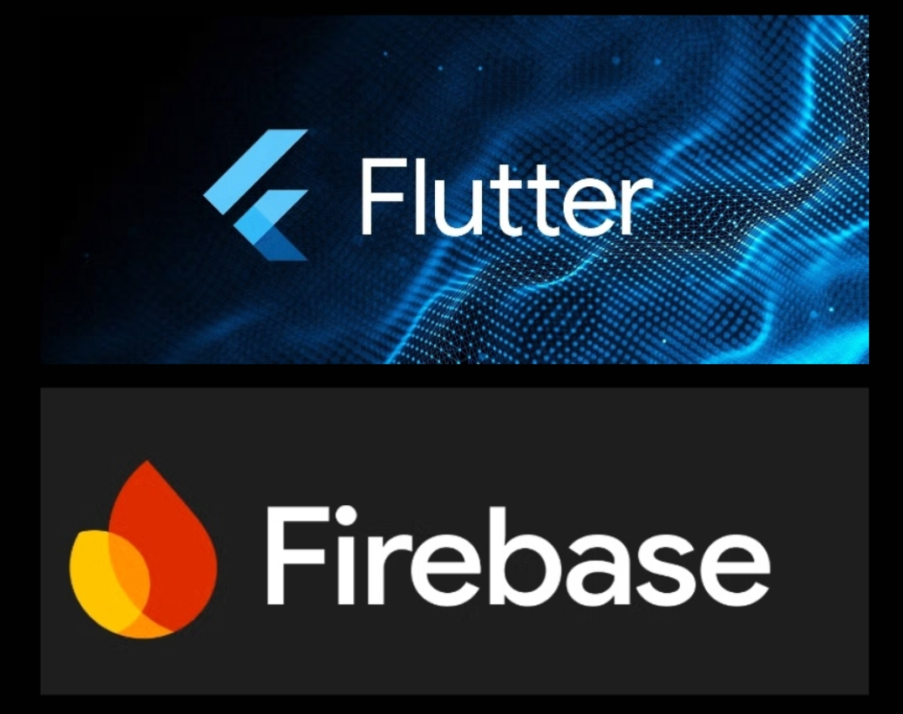

# 🎨 LIAS - AI 패션 스타일리스트 챗봇 앱

> **L**ife **I**ntelligent **A**ssistant **S**tylist  
> AI 챗봇 기반 패션 코디 평가 및 개인화된 스타일 조언을 제공하는 Flutter 모바일 애플리케이션

**개발자**: 김예중 (24101194)  
**개발 기간**: 2025.09.26 ~ 2025.11.21
**GitHub**: https://github.com/dsiaked/lias  
**라이센스**: [MIT License](https://github.com/dsiaked/lias/blob/main/LICENSE)

---

## 📋 목차

1. [프로젝트 배경](#-프로젝트-배경)
2. [앱 사용 흐름](#-앱-사용-흐름)
3. [사용된 기술](#-사용된-기술)
4. [참고 자료](#-참고-자료)

---

## 🎯 프로젝트 배경

### 배경
저는 매일 아침 "오늘은 무엇을 입을까?"라는 고민을 합니다. 또 매번 입을 때마다 "오늘 패션이 괜찮을까?" 라는 걱정을 가진 채 집 밖을 나갑니다. 그러나 집 밖을 나왔을 때는 이미 늦었습니다. 그날 하루종일 그 옷을 입어야 하고, 다른 사람들이 패션이 별로라 해도 집 밖에선 Hot Reloading을 할 수 없습니다.

LIAS는 이러한 일상적인 고민에 AI 기술을 접목하여, 집 밖을 나가기 전에 사용자 각각에 취향에 맞추고, 패션을 객관적으로 평가함으로써 이러한 상황을 방지하고, 그 뿐만이 아니라 진짜 "비서"처럼 날씨체크, 대화 등을 할 수 있게 함으로써 사용자에게 자신감 있는 하루를 시작할 수 있도록 돕는 **인생 비서(LIAS)**입니다.

### 핵심 가치
- **개인화된 조언**: 지역, 성별, 선호 색상을 고려한 맞춤형 피드백
- **날씨 기반 제안**: 실시간 날씨를 반영한 실용적인 스타일링 및 비서의 역할 수행
- **전문가 수준 평가**: 7가지 평가 기준을 바탕으로 한 AI 챗봇 의 심층 분석
- **대화형 AI**: 후속 질문으로 상세한 설명 제공

---

## 📱 앱 사용 흐름

### 1. 로그인 / 회원가입
앱을 실행하면 **로그인 화면**에서 시작합니다. 기본 이메일/비밀번호로 가입하거나 구글, 깃허브 계정으로 로그인합니다.

  
  

---

### 2. 온보딩 (첫 사용자)
"처음" 로그인한 사용자는 **온보딩 화면**으로 이동합니다. 여기서 다음 정보를 입력합니다:
- **성별** (남성/여성/기타)
- **지역** (예: 서울, 부산)
- **선호 색상** (8가지 색상 중 선택)

이 정보는 AI가 개인화된 조언을 제공하는 데 사용됩니다. 모든 정보를 입력해야 메인 화면으로 진입할 수 있습니다.

  

---

### 3. AI 초기화
온보딩 완료 후, 백그라운드에서 프롬프트로 학습된 AI 모델이 초기화됩니다.

  

---

### 4. 메인 화면 (바텀 네비게이션)
메인 화면은 **4개의 바텀 네비게이션**으로 구성됩니다, 4개의 구성은 다음과 같습니다:

#### 1 - 📸 Chats (AI 채팅)
- **갤러리에서 패션 사진 선택** → 프롬프트를 학습받은 AI가 일관된 평가기준에 맞게 패션에 사진이 올라온다면 실시간으로 패션을 분석하고, 점수를 매기고, 조언을 해줍니다.
- **LIAS (인생 비서)** → 패션 평가 뿐만이 아닌 일상적인 대화도 가능하게 합니다.
- **날씨 통합** → 온보딩에서 입력받은 사용자 지역의 실시간 날씨를 OpenWeather API로 조회하여 자연스럽게 조언합니다.

  
  

- **이전 대화 저장** → 오른쪽 위에 타이머(시계) 버튼을 클릭 할 시 이전 대화를 저장한 스크린으로 이동을 함으로써 언제든지 다시 그 대화로 돌아가서 추가로 대화를 할 수 있습니다.

---

#### 2 - 📅 Calendar (메모)
- **월간 달력 뷰**로 날짜별 메모 작성이 가능합니다.
- 패션 아이디어, 코디 계획 등을 기록할 수 있습니다.
- 아래에는 나중에 이 앱을 상용화 하였을 때에 광고받은 패션을 알맞게 넣어줄 공간이 있으면 좋을거 같아 추가하였습니다.

  

---

#### 3 - 📁 Folder (파일 관리)
- **폴더 생성/삭제** 기능
- 각 폴더 안에 **파일 생성/수정/삭제**
- 의도 : 일기장으로 활용을 하거나, 필요한 패션 아이템 등을 메모할 수 있게, 또 정말 다양한 메모를 간편하게 할 수 있게 하기 위해 존재합니다.

  

---

#### 4 - 👤 Profile (프로필)
- **프로필 이미지**: 갤러리에서 선택
- **이름 수정**: 다이얼로그로 변경
- **내 정보 수정**: 성별, 지역, 선호 색상 업데이트
- **현재 위치에 맞은 날씨 확인하기** : 날씨를 실시간으로 업데이트 함으로써 확인을 할 수 있습니다.

  

---

## 🛠 사용된 기술(간단하게)

- **Flutter** - Dart Language
- **Firebase** 
-   Authentication
-   Firebase Database

  

---

## 📚 참고 자료

### 공식 문서
- [Flutter Documentation](https://docs.flutter.dev/)
- [Firebase Documentation](https://firebase.google.com/docs)
- [Google Generative AI API](https://ai.google.dev/docs)
- [OpenWeather API](https://openweathermap.org/api)

### 튜토리얼
- [Firebase AI Logic 시작하기](https://firebase.google.com/docs/ai-logic/get-started?hl=ko)
- [Flutter Chat UI 구현](https://www.youtube.com/watch?v=aBNZvkj-YpE)
- [Gemini 프롬프트 엔지니어링](https://ai.google.dev/docs/prompt_best_practices)

### 주요 패키지
- [google_generative_ai](https://pub.dev/packages/google_generative_ai) - Gemini AI SDK
- [firebase_core](https://pub.dev/packages/firebase_core) - Firebase 초기화
- [firebase_auth](https://pub.dev/packages/firebase_auth) - 인증
- [cloud_firestore](https://pub.dev/packages/cloud_firestore) - 데이터베이스
- [table_calendar](https://pub.dev/packages/table_calendar) - 캘린더 UI
- [flutter_dotenv](https://pub.dev/packages/flutter_dotenv) - 환경 변수

---

## 📄 라이센스

이 프로젝트는 **MIT License** 하에 배포됩니다.  
자세한 내용은 [LICENSE](https://github.com/dsiaked/lias/blob/main/LICENSE) 파일을 참조하세요.

---

## + 개발자 회고

개발 과정과 기술적 도전, 그리고 배운 점들을 자세히 기록했습니다.  
👉 [개발 일지 보러가기](./coding_diary.md)

